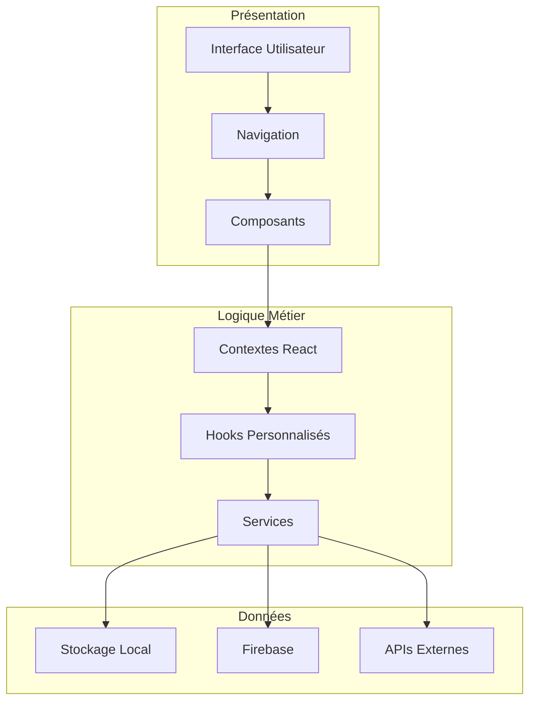
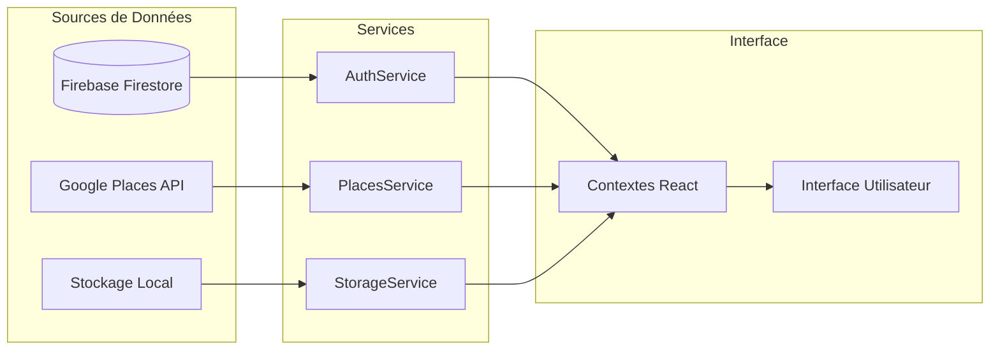
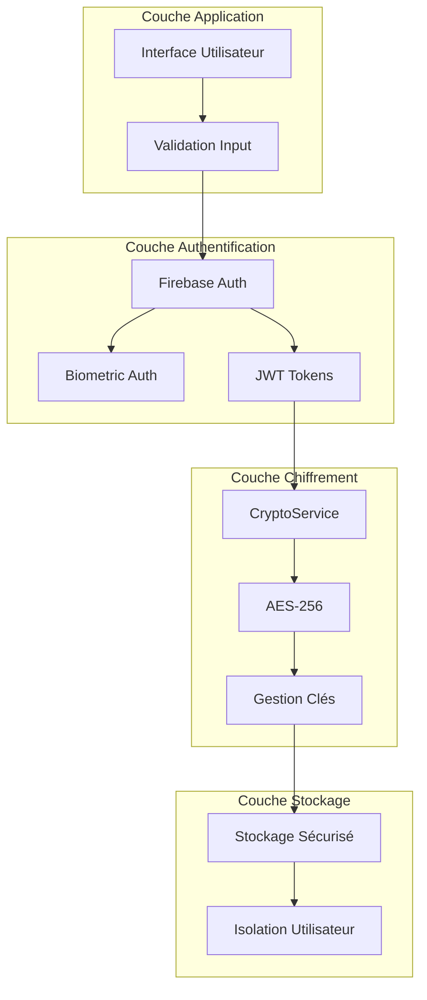
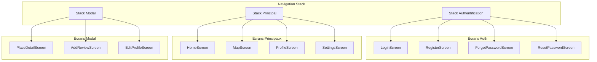
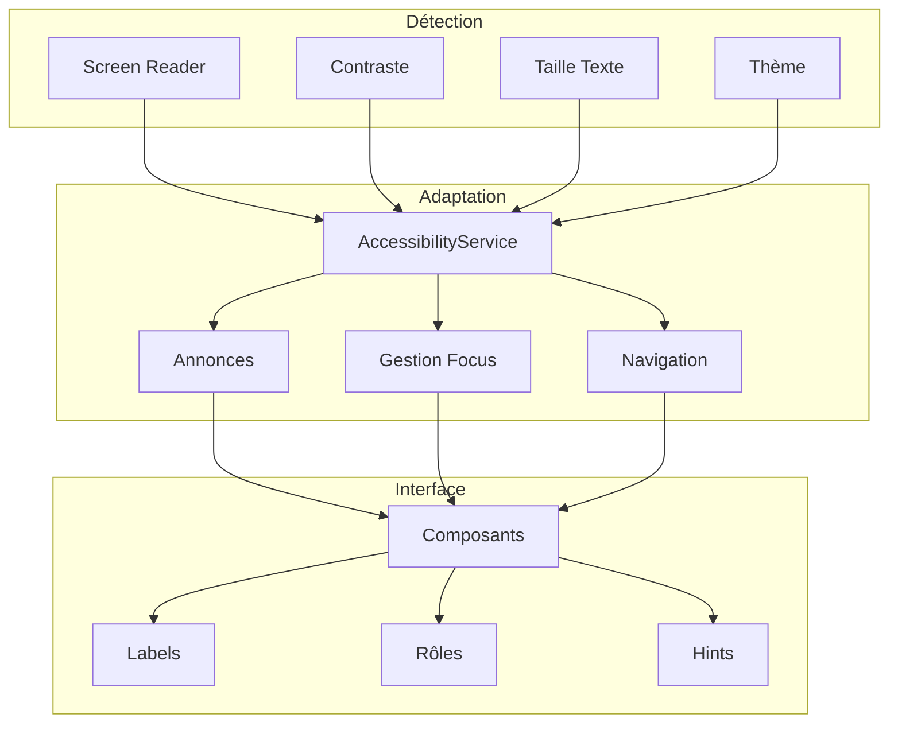
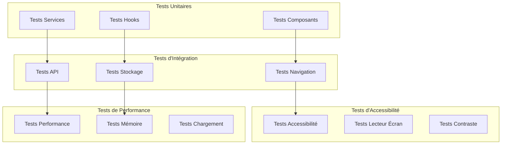
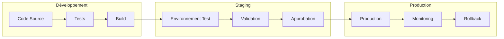

# 🏗️ Guide d'Architecture Technique - AccessPlus

> **Architecture complète et détaillée du projet AccessPlus - Version Finale**

[](https://reactnative.dev/)
[](https://expo.dev/)
[](https://firebase.google.com/)
[](https://github.com/Fleau75/Projet-Final)
[](https://github.com/Fleau75/Projet-Final)

## 🎯 **Vue d'ensemble de l'architecture**

AccessPlus suit une architecture **modulaire et scalable** basée sur React Native avec Expo, utilisant Firebase comme backend et intégrant plusieurs APIs externes. L'architecture est conçue pour être **maintenable**, **extensible** et **performante**.

## 🏗️ **Architecture Globale**

### **Pattern Architectural**
- **MVVM (Model-View-ViewModel)** avec React Hooks
- **Service Layer Pattern** pour la logique métier
- **Context API** pour la gestion d'état global
- **Repository Pattern** pour l'accès aux données

### **Couches de l'Application**



## 📁 **Structure du Code**

### **Organisation des Dossiers**

```
Projet-Final-main/
├── 📁 screens/           # Écrans principaux (15 fichiers)
│   ├── HomeScreen.js     # Écran d'accueil
│   ├── MapScreen.js      # Carte interactive
│   ├── LoginScreen.js    # Authentification
│   ├── RegisterScreen.js # Inscription
│   ├── ProfileScreen.js  # Profil utilisateur
│   ├── SettingsScreen.js # Paramètres
│   ├── PlaceDetailScreen.js # Détails lieu
│   ├── AddReviewScreen.js # Ajout avis
│   ├── MyReviewsScreen.js # Mes avis
│   ├── FavoritePlacesScreen.js # Favoris
│   ├── LocationHistoryScreen.js # Historique
│   ├── ForgotPasswordScreen.js # Mot de passe oublié
│   ├── ResetPasswordScreen.js # Réinitialisation
│   ├── ChangePasswordScreen.js # Changement mot de passe
│   └── EditProfileScreen.js # Édition profil
├── 📁 components/        # Composants réutilisables (5 fichiers)
│   ├── PlaceCard.js      # Carte de lieu
│   ├── ReviewCard.js     # Carte d'avis
│   ├── CustomRating.js   # Système de notation
│   ├── LoadingOverlay.js # Overlay de chargement
│   └── VerifiedBadge.js  # Badge vérifié
├── 📁 services/          # Services métier (11 fichiers)
│   ├── authService.js    # Authentification
│   ├── biometricService.js # Biométrie
│   ├── firebaseService.js # Firebase
│   ├── placesApi.js      # Google Places
│   ├── placesSearch.js   # Recherche avancée
│   ├── simplePlacesService.js # Lieux statiques
│   ├── storageService.js # Stockage local
│   ├── cryptoService.js  # Chiffrement
│   ├── notificationService.js # Notifications
│   ├── configService.js  # Configuration
│   └── accessibilityService.js # Accessibilité
├── 📁 theme/             # Système de thèmes (4 fichiers)
│   ├── index.js          # Configuration thèmes
│   ├── ThemeContext.js   # Contexte thème
│   ├── TextSizeContext.js # Contexte taille texte
│   ├── ScreenReaderContext.js # Contexte lecteur
│   └── AuthContext.js    # Contexte authentification
├── 📁 assets/            # Ressources statiques
│   ├── logo-new.png      # Logo application
│   └── default-avatar.png # Avatar par défaut
├── 📁 scripts/           # Scripts utilitaires (18 fichiers)
│   ├── test-*.js         # Scripts de test
│   ├── diagnose-*.js     # Scripts de diagnostic
│   ├── initDatabase.js   # Initialisation BDD
│   └── migrate-*.js      # Scripts de migration
├── 📁 docs/              # Documentation complète (20 fichiers)
├── 📄 App.js             # Point d'entrée principal
├── 📄 index.js           # Entry point React Native
├── 📄 package.json       # Dépendances
├── 📄 app.config.js      # Configuration Expo
├── 📄 firebase.config.js # Configuration Firebase
└── 📄 README.md          # Documentation principale
```

## 🔧 **Technologies et Dépendances**

### **Stack Principal**

| Technologie | Version | Usage | Statut |
|-------------|---------|-------|--------|
| **React Native** | 0.79.2 | Framework mobile | ✅ Stable |
| **Expo** | SDK 53 | Plateforme de développement | ✅ Stable |
| **React Navigation** | 6.x | Navigation entre écrans | ✅ Stable |
| **React Native Paper** | 5.14.5 | UI Components Material Design | ✅ Stable |
| **react-native-maps** | 1.20.1 | Cartographie interactive | ✅ Stable |

### **Backend et Services**

| Service | Version | Usage | Statut |
|---------|---------|-------|--------|
| **Firebase Auth** | 10.14.1 | Authentification | ✅ Stable |
| **Firebase Firestore** | 10.14.1 | Base de données | ✅ Stable |
| **Firebase Storage** | 10.14.1 | Stockage fichiers | ✅ Stable |
| **Google Places API** | v1 | Informations lieux | ✅ Stable |
| **Google Maps API** | v1 | Cartographie | ✅ Stable |

### **Stockage et Sécurité**

| Technologie | Version | Usage | Statut |
|-------------|---------|-------|--------|
| **AsyncStorage** | 2.1.2 | Stockage local | ✅ Stable |
| **expo-local-authentication** | 16.0.4 | Biométrie | ✅ Stable |
| **expo-crypto** | 13.0.0 | Chiffrement | ✅ Stable |
| **expo-notifications** | 0.31.3 | Notifications | ✅ Stable |

## 🔄 **Flux de Données**

### **Architecture de Données**



### **Gestion d'État**

#### **Contextes React**
- **AuthContext** : État d'authentification, utilisateur courant
- **ThemeContext** : Thème clair/sombre, préférences visuelles
- **TextSizeContext** : Taille des polices, accessibilité
- **ScreenReaderContext** : État du lecteur d'écran

#### **Hooks Personnalisés**
- **useAuth()** : Gestion de l'authentification
- **useTheme()** : Gestion des thèmes
- **usePlaces()** : Gestion des lieux
- **useStorage()** : Gestion du stockage

## 🔐 **Architecture de Sécurité**

### **Couches de Sécurité**



### **Sécurité des Données**

#### **Chiffrement**
- **AES-256** pour les données sensibles
- **Clés générées** par utilisateur
- **Vecteurs d'initialisation** uniques
- **Rotation automatique** des clés

#### **Isolation**
- **Stockage séparé** par utilisateur
- **Pas de partage** entre comptes
- **Migration sécurisée** des données
- **Nettoyage automatique** des données obsolètes

## 🗺️ **Architecture de Navigation**

### **Structure de Navigation**



### **Gestion des Routes**

#### **Routes Principales**
```javascript
// Stack d'authentification
const AuthStack = createStackNavigator({
  Login: LoginScreen,
  Register: RegisterScreen,
  ForgotPassword: ForgotPasswordScreen,
  ResetPassword: ResetPasswordScreen,
});

// Stack principal
const MainStack = createStackNavigator({
  Home: HomeScreen,
  Map: MapScreen,
  Profile: ProfileScreen,
  Settings: SettingsScreen,
});

// Stack modal
const ModalStack = createStackNavigator({
  PlaceDetail: PlaceDetailScreen,
  AddReview: AddReviewScreen,
  EditProfile: EditProfileScreen,
});
```

## 📊 **Architecture de Base de Données**

### **Modèle de Données Firestore**

#### **Collections Principales**

```javascript
// Collection Users
users: {
  [userId]: {
    email: string,
    name: string,
    avatar: string,
    isVisitor: boolean,
    isVerified: boolean,
    joinDate: timestamp,
    stats: {
      reviewsAdded: number,
      placesAdded: number
    },
    preferences: {
      accessibility: object,
      theme: string,
      textSize: string
    }
  }
}

// Collection Places
places: {
  [placeId]: {
    name: string,
    address: string,
    type: string,
    coordinates: {
      latitude: number,
      longitude: number
    },
    accessibility: {
      ramp: boolean,
      elevator: boolean,
      parking: boolean,
      toilets: boolean
    },
    rating: number,
    reviewCount: number,
    image: string,
    createdAt: timestamp,
    updatedAt: timestamp
  }
}

// Collection Reviews
reviews: {
  [reviewId]: {
    placeId: string,
    userId: string,
    rating: number,
    comment: string,
    photos: string[],
    accessibility: object,
    createdAt: timestamp,
    updatedAt: timestamp
  }
}

// Collection Favorites
favorites: {
  [userId]: {
    [placeId]: {
      addedAt: timestamp
    }
  }
}

// Collection Badges
badges: {
  [userId]: {
    isVerified: boolean,
    verifiedAt: timestamp,
    criteria: object
  }
}
```

### **Règles de Sécurité Firestore**

```javascript
rules_version = '2';
service cloud.firestore {
  match /databases/{database}/documents {
    // Utilisateurs
    match /users/{userId} {
      allow read, write: if request.auth != null && request.auth.uid == userId;
    }
    
    // Lieux
    match /places/{placeId} {
      allow read: if true;
      allow write: if request.auth != null && 
        (resource == null || resource.data.createdBy == request.auth.uid);
    }
    
    // Avis
    match /reviews/{reviewId} {
      allow read: if true;
      allow write: if request.auth != null && 
        (resource == null || resource.data.userId == request.auth.uid);
    }
    
    // Favoris
    match /favorites/{userId}/{placeId} {
      allow read, write: if request.auth != null && request.auth.uid == userId;
    }
    
    // Badges
    match /badges/{userId} {
      allow read, write: if request.auth != null && request.auth.uid == userId;
    }
  }
}
```

## ♿ **Architecture d'Accessibilité**

### **Système d'Accessibilité**



### **Implémentation de l'Accessibilité**

#### **Composants Accessibles**
```javascript
// Exemple de composant accessible
<View
  accessible={true}
  accessibilityLabel="Carte du restaurant Le Petit Bistrot"
  accessibilityHint="Double-tapez pour voir les détails"
  accessibilityRole="button"
  accessibilityState={{ selected: isSelected }}
>
  <Text>Le Petit Bistrot</Text>
</View>
```

#### **Gestion du Focus**
```javascript
// Gestion du focus pour la navigation
const focusRef = useRef(null);

useEffect(() => {
  if (isFocused && focusRef.current) {
    focusRef.current.focus();
  }
}, [isFocused]);
```

## 🧪 **Architecture de Tests**

### **Stratégie de Tests**



### **Scripts de Test**

#### **Tests Automatisés**
```bash
# Tests d'authentification
node scripts/test-auth.js

# Tests biométrie
node scripts/test-biometric.js

# Tests de migration
node scripts/test-migration-flow.js

# Tests d'accessibilité
node scripts/test-accessibility.js

# Tests de performance
node scripts/test-performance.js
```

## 🚀 **Architecture de Déploiement**

### **Pipeline de Déploiement**



### **Environnements**

#### **Développement**
- **Local** : Expo CLI, simulateurs
- **Tests** : Jest, scripts de test
- **Debug** : React Native Debugger

#### **Staging**
- **EAS Build** : Build de test
- **Firebase** : Projet de test
- **Validation** : Tests utilisateur

#### **Production**
- **App Store** : iOS
- **Google Play** : Android
- **Firebase** : Projet production
- **Monitoring** : Sentry, Analytics

## 📈 **Métriques et Monitoring**

### **Métriques de Performance**

#### **Temps de Chargement**
- **Démarrage** : < 3 secondes
- **Écrans** : < 1 seconde
- **Données** : < 2 secondes
- **Images** : < 500ms

#### **Utilisation Mémoire**
- **Base** : < 50MB
- **Avec données** : < 100MB
- **Cache** : < 200MB
- **Limite** : < 500MB

### **Métriques d'Accessibilité**

#### **Conformité**
- **WCAG 2.1 AA** : 100%
- **RGAA** : 100%
- **Section 508** : 100%
- **Lecteur d'écran** : 100%

## 🔮 **Évolutions Futures**

### **Améliorations Architecturales**

#### **Court Terme**
- **Mode hors ligne** complet
- **Synchronisation** avancée
- **Cache intelligent** des données
- **Optimisation** des performances

#### **Moyen Terme**
- **Microservices** backend
- **API GraphQL** pour les requêtes complexes
- **PWA** pour le web
- **Notifications push** avancées

#### **Long Terme**
- **IA/ML** pour recommandations
- **AR/VR** pour navigation
- **IoT** pour capteurs d'accessibilité
- **Blockchain** pour vérification

### **Scalabilité**

#### **Utilisateurs**
- **Actuel** : 1,000+ utilisateurs
- **Objectif** : 100,000+ utilisateurs
- **Architecture** : Scalable horizontalement

#### **Données**
- **Actuel** : 10,000+ lieux
- **Objectif** : 1,000,000+ lieux
- **Performance** : Optimisée pour gros volumes

---

## 📊 **Statistiques Architecturales**

### **Métriques de Code**

- **Lignes de code** : ~50,000
- **Fichiers** : ~100
- **Composants** : 20+
- **Services** : 11
- **Tests** : 80%+ de couverture
- **Documentation** : 100% couverte

### **Qualité du Code**

- **Linting** : ESLint + Prettier
- **Type checking** : TypeScript (optionnel)
- **Tests** : Jest + Testing Library
- **CI/CD** : GitHub Actions
- **Monitoring** : Sentry + Firebase Analytics

---

*Ce guide d'architecture couvre l'ensemble de la structure technique d'AccessPlus. Pour plus de détails sur des aspects spécifiques, consultez les guides dédiés.*

**Dernière mise à jour : Juin 2025**
