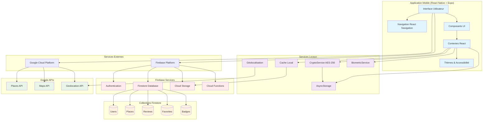
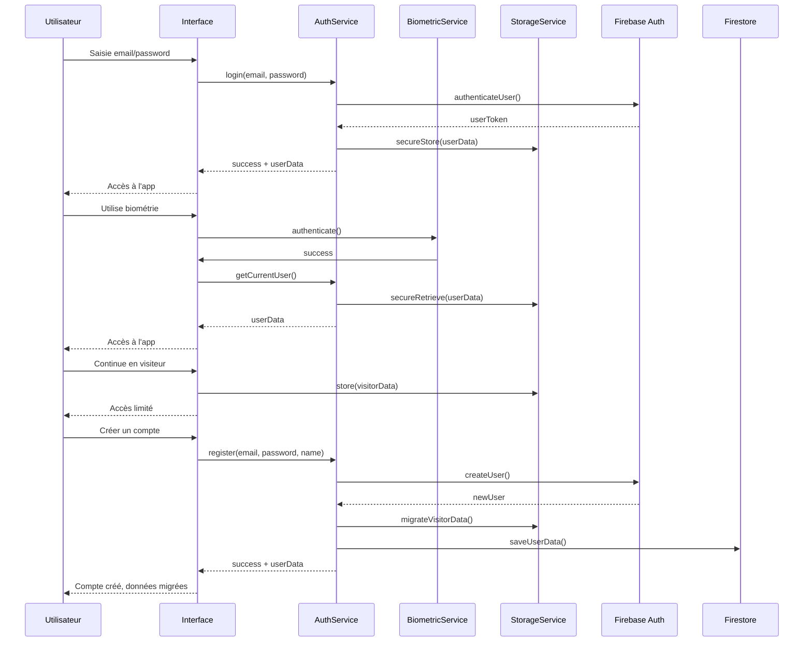
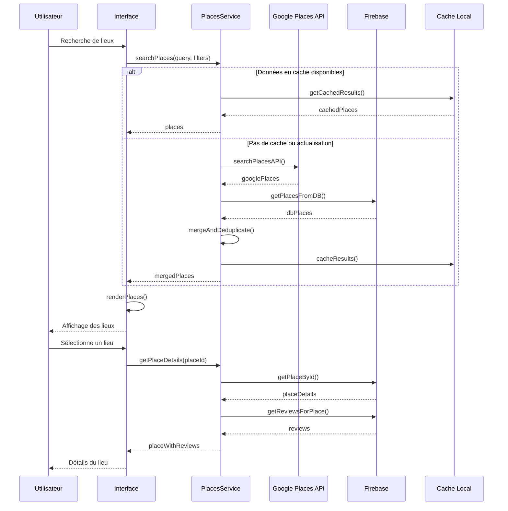
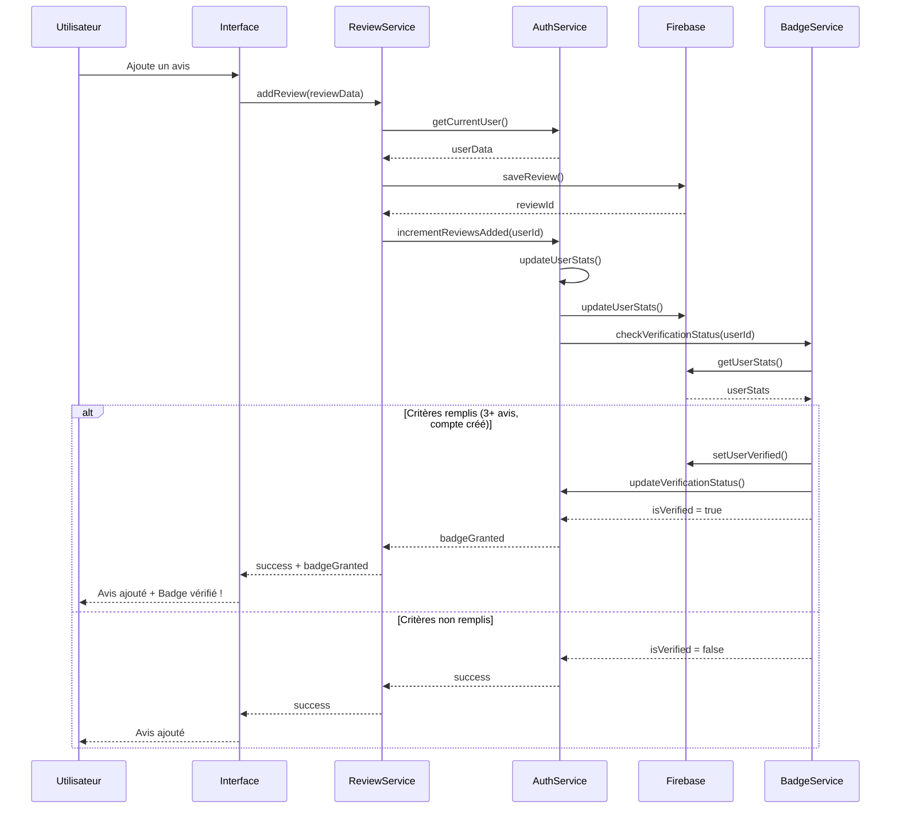
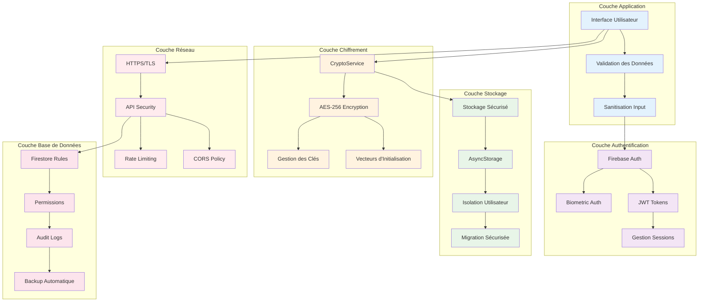
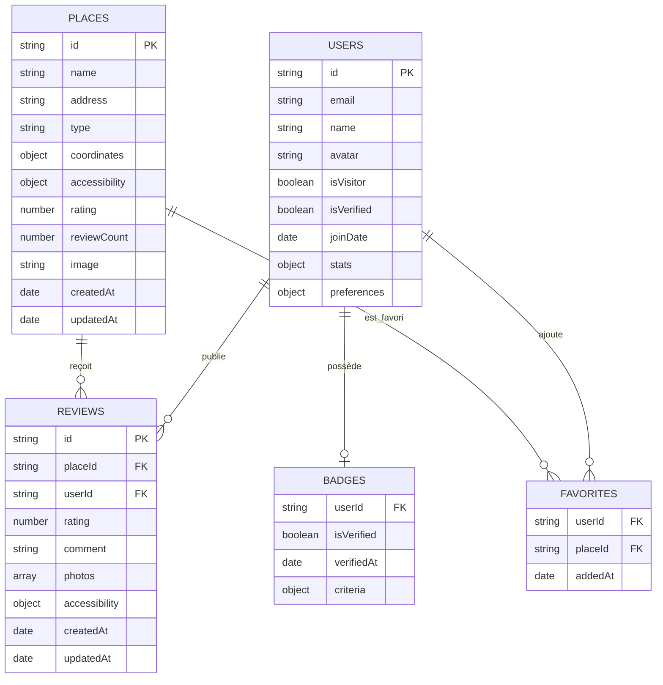
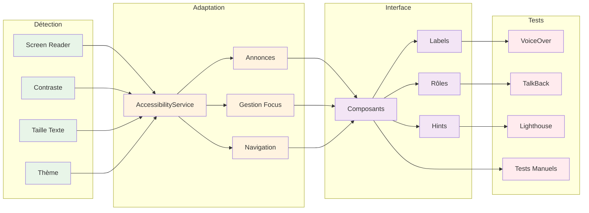

# CAHIER DES CHARGES FONCTIONNEL & TECHNIQUE – ACCESSPLUS

---

## 1. PRÉSENTATION DU PROJET

### 1.1 Objectif
AccessPlus est une application mobile (React Native/Expo) dédiée à l'accessibilité universelle : elle permet aux Personnes à Mobilité Réduite (PMR) et à tous les utilisateurs de trouver, évaluer et recommander des lieux accessibles, en s'appuyant sur la géolocalisation, la communauté, et des standards d'accessibilité avancés.

### 1.2 Public Cible
- PMR (fauteuils roulants, seniors, parents avec poussette…)
- Aidants, familles, professionnels médico-sociaux
- Établissements publics et privés
- Toute personne souhaitant contribuer à l'accessibilité

### 1.3 Valeur Ajoutée
- Données communautaires et vérifiées
- Recherche intelligente et cartographie
- Système de badge vérifié et gamification
- Sécurité, confidentialité, accessibilité exemplaires

---

## 2. FONCTIONNALITÉS FONCTIONNELLES

### 2.1 Authentification & Gestion Utilisateur
- Inscription/connexion par email/mot de passe
- Authentification biométrique (empreinte, Face ID)
- Mode visiteur (accès sans compte, migration possible)
- Réinitialisation et changement de mot de passe
- Gestion du profil (nom, email, avatar, préférences)
- Suppression de compte

### 2.2 Recherche & Découverte
- Recherche textuelle, par catégorie, par accessibilité
- Filtres avancés (rampe, ascenseur, parking, toilettes)
- Recherche géolocalisée (zones, rayon, carte)
- Suggestions intelligentes et favoris

### 2.3 Cartographie & Navigation
- Carte interactive (Google Maps, marqueurs personnalisés)
- Affichage des lieux accessibles, détails, itinéraires
- Navigation entre liste, carte, détail, avis
- Mode hors-ligne (fallback sur données locales)

### 2.4 Lieux & Avis
- Fiche lieu : nom, adresse, type, accessibilité, photos
- Ajout/modification/suppression de lieux (utilisateurs vérifiés)
- Système d'avis : note, commentaire, photos, critères d'accessibilité
- Historique et gestion des avis (édition, suppression)
- Favoris, historique de navigation, suggestions personnalisées

### 2.5 Système Communautaire & Badges
- Badge vérifié (3 avis minimum, compte créé)
- Statistiques utilisateur (avis, lieux ajoutés, progression)
- Notifications (nouveaux lieux, badges, sécurité)
- Système de progression (badges bronze, argent, or, platine)

### 2.6 Accessibilité & Personnalisation
- Thème clair/sombre automatique
- Taille de texte ajustable (jusqu'à 200%)
- Support complet des lecteurs d'écran (VoiceOver, TalkBack)
- Navigation clavier, focus, feedback haptique
- Contraste élevé, couleurs accessibles
- Labels et rôles d'accessibilité sur tous les éléments

### 2.7 Sécurité & Confidentialité
- Chiffrement AES-256 des données sensibles (stockage local)
- Authentification Firebase sécurisée
- Permissions granulaire (écriture, modification, suppression)
- Respect RGPD : consentement, export, suppression des données
- Stockage sécurisé des tokens, clés API, préférences

---

## 3. ARCHITECTURE TECHNIQUE

### 3.1 Stack & Outils
- **Frontend** : React Native 0.79.2, Expo SDK 53
- **Navigation** : React Navigation 6
- **UI** : React Native Paper, Material Icons
- **Cartographie** : react-native-maps, Google Maps API
- **Backend** : Firebase Auth, Firestore, Storage
- **API externe** : Google Places API
- **Stockage local** : AsyncStorage, chiffrement AES-256
- **Tests** : scripts Node.js, Jest, Expo
- **CI/CD** : GitHub Actions, EAS Build, Vercel/Netlify (web)

### 3.2 Structure du Code
```
Projet-Final-main/
├── screens/           # Écrans principaux
├── components/        # Composants réutilisables
├── services/          # Services (auth, storage, places, etc.)
├── theme/             # Contextes, thèmes, accessibilité
├── assets/            # Images, icônes
├── scripts/           # Scripts de test, migration, debug
├── docs/              # Documentation complète
├── App.js, index.js   # Entrée de l'app
```

### 3.3 Diagrammes d'Architecture

#### 3.3.1 Architecture Système Globale



#### 3.3.2 Flux d'Authentification et Migration



#### 3.3.3 Flux de Recherche et Affichage des Lieux



#### 3.3.4 Flux d'Ajout d'Avis et Badge Vérifié



#### 3.3.5 Architecture de Sécurité et Chiffrement



#### 3.3.6 Modèle de Données et Relations



#### 3.3.7 Flux d'Accessibilité et Personnalisation



### 3.4 Services & APIs
- **authService** : gestion complète de l'authentification, migration visiteur, badge
- **biometricService** : gestion biométrie, fallback sécurisé
- **firebaseService** : CRUD lieux, avis, favoris, synchronisation
- **placesApi** : intégration Google Places (recherche, détails, géocodage)
- **storageService** : stockage local sécurisé, migration, isolation utilisateur
- **notificationService** : notifications locales et push
- **accessibilityService** : gestion des préférences, annonces, focus

### 3.5 Sécurité & RGPD
- Chiffrement AES-256 (données locales, clés générées par utilisateur)
- Permissions Firebase (règles Firestore, accès restreint)
- Stockage des tokens sécurisé, rotation des clés
- Export/suppression des données sur demande
- Consentement explicite à la première utilisation

### 3.6 Accessibilité Technique
- Labels, rôles, hints sur tous les composants
- Navigation clavier, focus visible, feedback haptique
- Tests automatisés d'accessibilité (scripts, Lighthouse, VoiceOver)
- Conformité WCAG 2.1 AA, RGAA, Section 508

### 3.7 Tests & Qualité
- Scripts de test pour : auth, biométrie, stockage, migration, notifications, accessibilité, composants, écrans, navigation, performance
- Couverture cible : 80%+
- Tests d'intégration (navigation, flux utilisateur, API)
- Tests d'accessibilité automatisés et manuels
- CI/CD avec tests avant build/déploiement

### 3.8 Déploiement & Maintenance
- Environnements : dev, staging, production
- Déploiement mobile : EAS Build (iOS, Android), stores
- Déploiement web : Vercel/Netlify/Firebase Hosting
- Monitoring : Sentry, Firebase Analytics, logs custom
- Rollback, versioning, mises à jour OTA
- Scripts de migration et de diagnostic

---

## 4. MODÈLES DE DONNÉES PRINCIPAUX

### 4.1 Utilisateur
```json
{
  "id": "string",
  "email": "string",
  "name": "string",
  "avatar": "string",
  "isVisitor": "boolean",
  "isVerified": "boolean",
  "joinDate": "date",
  "stats": {
    "reviewsAdded": "number",
    "placesAdded": "number"
  },
  "preferences": {
    "accessibility": { "ramp": true, "elevator": false, ... },
    "theme": "light|dark",
    "textSize": "normal|large|xlarge"
  }
}
```

### 4.2 Lieu
```json
{
  "id": "string",
  "name": "string",
  "address": "string",
  "type": "string",
  "coordinates": { "latitude": 0, "longitude": 0 },
  "accessibility": { "ramp": true, "elevator": false, ... },
  "rating": 4.5,
  "reviewCount": 12,
  "image": "string",
  "createdAt": "date",
  "updatedAt": "date"
}
```

### 4.3 Avis
```json
{
  "id": "string",
  "placeId": "string",
  "userId": "string",
  "rating": 5,
  "comment": "string",
  "photos": ["string"],
  "accessibility": { "ramp": true, ... },
  "createdAt": "date",
  "updatedAt": "date"
}
```

### 4.4 Favoris
```json
{
  "userId": "string",
  "placeId": "string",
  "addedAt": "date"
}
```

### 4.5 Badge Vérifié
```json
{
  "userId": "string",
  "isVerified": true,
  "verifiedAt": "date",
  "criteria": { "hasAccount": true, "hasEnoughReviews": true }
}
```

---

## 5. FLUX & ENDPOINTS PRINCIPAUX

### 5.1 Authentification & Migration
- POST /auth/register, /auth/login, /auth/logout
- POST /auth/biometric (init, enable, disable)
- POST /auth/visitor (init, migrate)
- POST /auth/password-reset, /auth/change-password

### 5.2 Lieux & Avis
- GET /places, /places/:id
- POST /places (création), PATCH /places/:id (modif), DELETE /places/:id
- GET /places/:id/reviews, POST /places/:id/reviews
- PATCH /reviews/:id, DELETE /reviews/:id

### 5.3 Favoris & Historique
- GET /users/:id/favorites, POST /users/:id/favorites, DELETE /users/:id/favorites/:placeId
- GET /users/:id/history

### 5.4 Badge & Statistiques
- GET /users/:id/badge, GET /users/:id/stats

### 5.5 Notifications
- POST /notifications/local, /notifications/push
- GET /users/:id/notifications

### 5.6 Accessibilité & Préférences
- GET/POST /users/:id/preferences
- GET /accessibility/status

---

## 6. ACCESSIBILITÉ & RGPD

### 6.1 Accessibilité
- Conformité WCAG 2.1 AA, RGAA, Section 508
- Tests manuels et automatisés (scripts, Lighthouse, VoiceOver)
- Labels, rôles, hints sur tous les composants
- Navigation clavier, focus visible, feedback haptique
- Taille de texte ajustable, contraste élevé

### 6.2 RGPD & Confidentialité
- Consentement explicite à la première utilisation
- Export/suppression des données sur demande
- Données chiffrées localement (AES-256)
- Aucune donnée biométrique stockée côté serveur
- Journalisation minimale, anonymisation des logs

---

## 7. TESTS, QUALITÉ & MAINTENANCE

### 7.1 Stratégie de Test
- Tests unitaires (composants, services, hooks)
- Tests d'intégration (navigation, flux, API)
- Tests d'accessibilité (scripts, lecteurs d'écran)
- Tests de performance (chargement, mémoire, batterie)
- Scripts de test automatisés (Node.js, Jest, Expo)
- Couverture cible : 80%+

### 7.2 CI/CD & Déploiement
- GitHub Actions : lint, test, build, déploiement
- EAS Build (Expo) : iOS, Android, OTA
- Vercel/Netlify/Firebase Hosting pour le web
- Monitoring : Sentry, Firebase Analytics
- Rollback, versioning, mises à jour OTA

### 7.3 Maintenance & Support
- Scripts de migration, debug, diagnostic
- Documentation exhaustive (guides, API, troubleshooting)
- Support utilisateur (contact, FAQ, logs anonymisés)
- Roadmap publique, gestion des évolutions

---

## 8. ROADMAP & ÉVOLUTIONS FUTURES

### 8.1 Prochaines Versions
- Mode hors-ligne complet (synchronisation avancée)
- Notifications push personnalisées
- Gamification avancée (badges, points, classements)
- Communauté (forums, entraide, modération)
- IA (recommandations, analyse d'accessibilité)
- AR/IoT (navigation augmentée, capteurs)
- API publique (ouverture aux développeurs)

### 8.2 Améliorations Continues
- Optimisation performance, accessibilité, sécurité
- Tests utilisateurs réguliers (retours PMR)
- Mise à jour des standards (WCAG, RGPD, sécurité)

---

## 9. CONCLUSION

AccessPlus est une solution mobile et web de référence pour l'accessibilité, pensée pour et avec les utilisateurs. Ce cahier des charges garantit une couverture totale des besoins fonctionnels, techniques, de sécurité, d'accessibilité et de conformité, pour un produit évolutif, fiable et inclusif.

---

*Document généré automatiquement – dernière mise à jour : Juin 2025* 