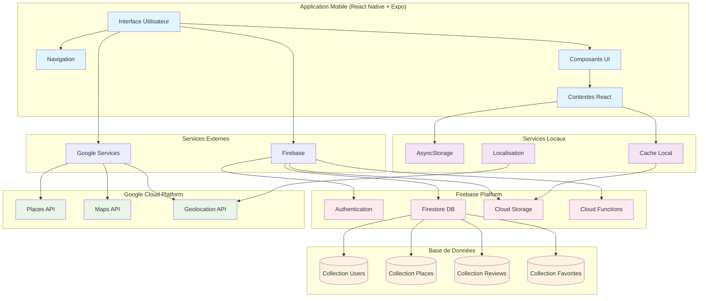

# CAHIER DES CHARGES - APPLICATION ACCESSPLUS

## 1. PRÉSENTATION DU PROJET

### 1.1 Contexte et Objectif
**AccessPlus** est une application mobile React Native dédiée aux Personnes à Mobilité Réduite (PMR) pour faciliter la découverte et l'évaluation de lieux accessibles. L'application permet aux utilisateurs de rechercher, localiser et partager des informations sur l'accessibilité des établissements.

### 1.2 Public Cible
- Personnes à mobilité réduite (utilisateurs de fauteuils roulants, personnes âgées)
- Accompagnants et aidants
- Professionnels du secteur médico-social
- Établissements souhaitant améliorer leur accessibilité

### 1.3 Valeur Ajoutée
- Centralisation des informations d'accessibilité
- Système de notation et d'avis communautaire
- Géolocalisation précise des lieux accessibles
- Interface adaptée aux besoins spécifiques des PMR

## 2. FONCTIONNALITÉS FONCTIONNELLES

### 2.1 Gestion des Utilisateurs

#### 2.1.1 Authentification
- **Inscription** : Création de compte avec email, mot de passe, prénom, nom, téléphone (optionnel)
- **Connexion** : Authentification par email/mot de passe
- **Validation** : Vérification des champs obligatoires et format email
- **Sécurité** : Mots de passe sécurisés (minimum 6 caractères)

#### 2.1.2 Profil Utilisateur
- **Informations personnelles** : Modification du profil (nom, prénom, téléphone)
- **Historique** : Consultation des avis publiés
- **Préférences** : Sauvegarde des paramètres d'accessibilité
- **Statistiques** : Nombre d'avis publiés, lieux visités

### 2.2 Recherche et Découverte

#### 2.2.1 Recherche de Lieux
- **Recherche textuelle** : Saisie libre de noms d'établissements
- **Recherche par catégorie** : Filtrage par type d'établissement
  - Restaurants (🍽️)
  - Culture (🎭)
  - Shopping (🛍️)
  - Santé (🏥)
  - Sport (🏃)
  - Éducation (📚)
- **Recherche géolocalisée** : Lieux à proximité de la position utilisateur
- **Rayon de recherche** : Paramétrable (par défaut 1km)

#### 2.2.2 Filtres d'Accessibilité
- **Rampes d'accès** : Présence de rampes
- **Ascenseurs** : Disponibilité d'ascenseurs
- **Parking adapté** : Places de parking accessibles
- **Toilettes adaptées** : Sanitaires accessibles
- **Filtres combinés** : Application de plusieurs critères simultanément

### 2.3 Cartographie Interactive

#### 2.3.1 Affichage Carte
- **Carte Google Maps** : Intégration native avec react-native-maps
- **Marqueurs personnalisés** : Icônes distinctives par catégorie
- **Position utilisateur** : Géolocalisation en temps réel
- **Thèmes** : Mode clair/sombre adaptatif

#### 2.3.2 Interactions Carte
- **Navigation** : Déplacement et zoom sur la carte
- **Sélection** : Tap sur marqueur pour afficher détails
- **Centrage** : Retour automatique sur position utilisateur
- **Ajout manuel** : Possibilité d'ajouter des lieux non répertoriés

### 2.4 Système d'Évaluation

#### 2.4.1 Notation
- **Système de notes** : Échelle de 1 à 5 étoiles
- **Critères multiples** : Évaluation par aspect d'accessibilité
- **Avis textuels** : Commentaires détaillés
- **Photos** : Ajout d'images illustratives

#### 2.4.2 Gestion des Avis
- **Publication** : Ajout d'avis avec formulaire détaillé
- **Modification** : Édition des avis existants
- **Suppression** : Retrait d'avis publiés
- **Historique** : Consultation de tous les avis de l'utilisateur

### 2.5 Favoris et Historique

#### 2.5.1 Lieux Favoris
- **Ajout aux favoris** : Marquage des lieux préférés
- **Liste personnelle** : Consultation des favoris
- **Organisation** : Tri par nom, distance, note
- **Suppression** : Retrait des favoris

#### 2.5.2 Historique de Navigation
- **Suivi des visites** : Enregistrement des lieux consultés
- **Statistiques** : Analyse des habitudes de recherche
- **Suggestions** : Recommandations basées sur l'historique

### 2.6 Paramètres et Personnalisation

#### 2.6.1 Accessibilité
- **Taille de texte** : Ajustement de la taille des polices
- **Contraste** : Mode sombre/clair
- **Lecteur d'écran** : Support des technologies d'assistance
- **Navigation** : Adaptation des interactions tactiles

#### 2.6.2 Préférences Utilisateur
- **Langue** : Interface en français
- **Unités** : Distances en mètres/kilomètres
- **Notifications** : Alertes pour nouveaux lieux accessibles
- **Confidentialité** : Gestion des données personnelles

## 3. ARCHITECTURE TECHNIQUE

### 3.1 Stack Technologique

#### 3.1.1 Frontend
- **Framework** : React Native 0.79.2
- **Plateforme** : Expo SDK 53
- **Navigation** : React Navigation 6
- **UI Components** : React Native Paper 5.14.5
- **Maps** : react-native-maps 1.20.1
- **Icons** : Material Community Icons

#### 3.1.2 Backend et Services
- **Base de données** : Firebase Firestore
- **Authentification** : Firebase Auth
- **Stockage** : Firebase Storage (images)
- **API externe** : Google Places API
- **Stockage local** : AsyncStorage

#### 3.1.3 Outils de Développement
- **Bundler** : Metro 0.82.4
- **Transpileur** : Babel
- **Gestionnaire de paquets** : npm
- **Versioning** : Git

### 3.2 Structure de l'Application

#### 3.2.1 Organisation des Dossiers
```
AccessPlus/
├── screens/           # Écrans de l'application
├── components/        # Composants réutilisables
├── services/          # Services et API
├── theme/            # Thèmes et contextes
├── assets/           # Ressources statiques
└── scripts/          # Scripts utilitaires
```

#### 3.2.2 Écrans Principaux
- **LoginScreen** : Authentification
- **RegisterScreen** : Inscription
- **HomeScreen** : Accueil avec liste des lieux
- **MapScreen** : Carte interactive
- **ProfileScreen** : Profil utilisateur
- **SettingsScreen** : Paramètres
- **PlaceDetailScreen** : Détails d'un lieu
- **AddReviewScreen** : Ajout d'avis
- **MyReviewsScreen** : Mes avis
- **FavoritePlacesScreen** : Lieux favoris
- **LocationHistoryScreen** : Historique
- **EditProfileScreen** : Édition du profil

#### 3.2.3 Composants
- **PlaceCard** : Carte d'affichage d'un lieu
- **ReviewCard** : Affichage d'un avis
- **CustomRating** : Système de notation
- **LoadingOverlay** : Indicateur de chargement

### 3.3 Services et API

#### 3.3.1 Firebase Service
- **Authentification** : Gestion des utilisateurs
- **Firestore** : Stockage des données
- **Storage** : Gestion des images
- **Synchronisation** : Mise à jour en temps réel

#### 3.3.2 Google Places API
- **Recherche de lieux** : Autocomplétion et suggestions
- **Détails des lieux** : Informations complètes
- **Géolocalisation** : Coordonnées précises
- **Photos** : Images des établissements

#### 3.3.3 Services Locaux
- **AccessibilityService** : Gestion des préférences d'accessibilité
- **PlacesSearch** : Recherche avancée
- **SimplePlacesService** : Données de fallback

### 3.4 Gestion des États

#### 3.4.1 Contextes React
- **ThemeContext** : Gestion des thèmes (clair/sombre)
- **TextSizeContext** : Taille des polices
- **ScreenReaderContext** : Support lecteur d'écran

#### 3.4.2 État Local
- **useState** : État des composants
- **useEffect** : Effets de bord
- **useCallback** : Optimisation des performances

### 3.5 Diagramme d'Architecture Système



### 3.6 Documentation API

#### 3.6.1 Firebase Authentication API

##### **Inscription Utilisateur**
```javascript
// POST /auth/register
{
  "email": "string",
  "password": "string", 
  "firstName": "string",
  "lastName": "string",
  "phone": "string (optionnel)"
}

// Réponse
{
  "success": true,
  "user": {
    "uid": "string",
    "email": "string",
    "firstName": "string",
    "lastName": "string",
    "phone": "string",
    "createdAt": "timestamp"
  }
}
```

##### **Connexion Utilisateur**
```javascript
// POST /auth/login
{
  "email": "string",
  "password": "string"
}

// Réponse
{
  "success": true,
  "user": {
    "uid": "string",
    "email": "string",
    "firstName": "string",
    "lastName": "string",
    "phone": "string"
  },
  "token": "string"
}
```

#### 3.6.2 Firestore Database API

##### **Gestion des Lieux**

###### **Récupérer tous les lieux**
```javascript
// GET /places
// Paramètres de requête
{
  "category": "string (optionnel)",
  "latitude": "number (optionnel)",
  "longitude": "number (optionnel)",
  "radius": "number (optionnel, défaut: 1000m)",
  "limit": "number (optionnel, défaut: 20)"
}

// Réponse
{
  "places": [
    {
      "id": "string",
      "name": "string",
      "address": "string",
      "type": "string",
      "coordinates": {
        "latitude": "number",
        "longitude": "number"
      },
      "accessibility": {
        "ramp": "boolean",
        "elevator": "boolean",
        "parking": "boolean",
        "toilets": "boolean"
      },
      "rating": "number",
      "reviewCount": "number",
      "image": "string",
      "distance": "number"
    }
  ],
  "total": "number"
}
```

###### **Récupérer un lieu par ID**
```javascript
// GET /places/{placeId}

// Réponse
{
  "id": "string",
  "name": "string",
  "address": "string",
  "type": "string",
  "coordinates": {
    "latitude": "number",
    "longitude": "number"
  },
  "accessibility": {
    "ramp": "boolean",
    "elevator": "boolean",
    "parking": "boolean",
    "toilets": "boolean"
  },
  "rating": "number",
  "reviewCount": "number",
  "image": "string",
  "reviews": [
    {
      "id": "string",
      "userId": "string",
      "rating": "number",
      "comment": "string",
      "photos": ["string"],
      "accessibility": {
        "ramp": "boolean",
        "elevator": "boolean",
        "parking": "boolean",
        "toilets": "boolean"
      },
      "createdAt": "timestamp"
    }
  ]
}
```

###### **Ajouter un nouveau lieu**
```javascript
// POST /places
{
  "name": "string",
  "address": "string",
  "type": "string",
  "coordinates": {
    "latitude": "number",
    "longitude": "number"
  },
  "accessibility": {
    "ramp": "boolean",
    "elevator": "boolean",
    "parking": "boolean",
    "toilets": "boolean"
  },
  "image": "string (optionnel)"
}

// Réponse
{
  "success": true,
  "placeId": "string",
  "message": "Lieu ajouté avec succès"
}
```

##### **Gestion des Avis**

###### **Ajouter un avis**
```javascript
// POST /places/{placeId}/reviews
{
  "rating": "number (1-5)",
  "comment": "string",
  "photos": ["string (optionnel)"],
  "accessibility": {
    "ramp": "boolean",
    "elevator": "boolean",
    "parking": "boolean",
    "toilets": "boolean"
  }
}

// Réponse
{
  "success": true,
  "reviewId": "string",
  "message": "Avis ajouté avec succès"
}
```

###### **Récupérer les avis d'un lieu**
```javascript
// GET /places/{placeId}/reviews
// Paramètres de requête
{
  "limit": "number (optionnel, défaut: 10)",
  "offset": "number (optionnel, défaut: 0)",
  "sortBy": "string (optionnel: 'date', 'rating', défaut: 'date')"
}

// Réponse
{
  "reviews": [
    {
      "id": "string",
      "userId": "string",
      "userName": "string",
      "rating": "number",
      "comment": "string",
      "photos": ["string"],
      "accessibility": {
        "ramp": "boolean",
        "elevator": "boolean",
        "parking": "boolean",
        "toilets": "boolean"
      },
      "createdAt": "timestamp"
    }
  ],
  "total": "number",
  "averageRating": "number"
}
```

##### **Gestion des Favoris**

###### **Ajouter aux favoris**
```javascript
// POST /users/{userId}/favorites
{
  "placeId": "string"
}

// Réponse
{
  "success": true,
  "message": "Lieu ajouté aux favoris"
}
```

###### **Récupérer les favoris**
```javascript
// GET /users/{userId}/favorites

// Réponse
{
  "favorites": [
    {
      "placeId": "string",
      "addedAt": "timestamp",
      "place": {
        "id": "string",
        "name": "string",
        "address": "string",
        "type": "string",
        "rating": "number",
        "image": "string"
      }
    }
  ]
}
```

#### 3.6.3 Google Places API

##### **Recherche de lieux**
```javascript
// GET /places/search
// Paramètres de requête
{
  "query": "string",
  "location": "string (optionnel)",
  "radius": "number (optionnel, défaut: 5000)",
  "type": "string (optionnel)",
  "language": "string (optionnel, défaut: 'fr')"
}

// Réponse
{
  "predictions": [
    {
      "place_id": "string",
      "description": "string",
      "structured_formatting": {
        "main_text": "string",
        "secondary_text": "string"
      }
    }
  ]
}
```

##### **Détails d'un lieu**
```javascript
// GET /places/details/{placeId}
// Paramètres de requête
{
  "fields": "string (optionnel, défaut: 'name,formatted_address,geometry,photos,types')",
  "language": "string (optionnel, défaut: 'fr')"
}

// Réponse
{
  "place_id": "string",
  "name": "string",
  "formatted_address": "string",
  "geometry": {
    "location": {
      "lat": "number",
      "lng": "number"
    }
  },
  "photos": [
    {
      "photo_reference": "string",
      "width": "number",
      "height": "number"
    }
  ],
  "types": ["string"],
  "rating": "number",
  "user_ratings_total": "number"
}
```

#### 3.6.4 Codes d'Erreur

| Code | Description | Solution |
|------|-------------|----------|
| 400 | Requête invalide | Vérifier les paramètres |
| 401 | Non authentifié | Se connecter |
| 403 | Accès refusé | Vérifier les permissions |
| 404 | Ressource non trouvée | Vérifier l'ID |
| 429 | Trop de requêtes | Attendre et réessayer |
| 500 | Erreur serveur | Contacter le support |

#### 3.6.5 Limites et Quotas

##### **Firebase**
- **Firestore** : 1M lectures/jour, 100K écritures/jour
- **Storage** : 5GB stockage, 1GB transfert/jour
- **Auth** : 10K utilisateurs actifs

##### **Google Places API**
- **Recherche** : 1000 requêtes/jour
- **Détails** : 1000 requêtes/jour
- **Photos** : 1000 requêtes/jour

## 4. FONCTIONNALITÉS TECHNIQUES

### 4.1 Performance

#### 4.1.1 Optimisations
- **Lazy Loading** : Chargement à la demande
- **Memoization** : Mise en cache des composants
- **Image Optimization** : Compression et redimensionnement
- **Debouncing** : Limitation des appels API

#### 4.1.2 Gestion Mémoire
- **Cleanup** : Nettoyage des listeners
- **Image Caching** : Stockage local des images
- **Data Pagination** : Chargement par pages

### 4.2 Sécurité

#### 4.2.1 Authentification
- **Validation** : Vérification des données d'entrée
- **Encryption** : Chiffrement des mots de passe
- **Sessions** : Gestion sécurisée des sessions
- **Permissions** : Contrôle d'accès aux fonctionnalités

#### 4.2.2 Données
- **Validation** : Sanitisation des données
- **Backup** : Sauvegarde automatique
- **Privacy** : Respect du RGPD

### 4.3 Accessibilité

#### 4.3.1 Interface
- **Contraste** : Ratios WCAG conformes
- **Taille de texte** : Ajustable jusqu'à 200%
- **Navigation** : Support clavier et tactile
- **Couleurs** : Indépendance des informations à la couleur

#### 4.3.2 Technologies d'Assistance
- **Screen Reader** : Support VoiceOver (iOS) et TalkBack (Android)
- **Labels** : Attributs accessibilityLabel
- **Focus** : Gestion du focus pour navigation clavier
- **Announcements** : Notifications vocales

### 4.4 Compatibilité

#### 4.4.1 Plateformes
- **iOS** : Version 13.0 et supérieures
- **Android** : API level 21 et supérieures
- **Responsive** : Adaptation aux différentes tailles d'écran

#### 4.4.2 Connectivité
- **Mode hors ligne** : Fonctionnalités de base disponibles
- **Synchronisation** : Mise à jour lors du retour en ligne
- **Cache** : Stockage local des données essentielles

## 5. DONNÉES ET MODÈLES

### 5.1 Structure des Données

#### 5.1.1 Utilisateur
```javascript
{
  id: string,
  email: string,
  firstName: string,
  lastName: string,
  phone: string,
  joinDate: Date,
  preferences: {
    accessibility: {
      requireRamp: boolean,
      requireElevator: boolean,
      requireAccessibleParking: boolean,
      requireAccessibleToilets: boolean
    },
    textSize: string,
    theme: 'light' | 'dark'
  }
}
```

#### 5.1.2 Lieu
```javascript
{
  id: string,
  name: string,
  address: string,
  type: string,
  coordinates: {
    latitude: number,
    longitude: number
  },
  accessibility: {
    ramp: boolean,
    elevator: boolean,
    parking: boolean,
    toilets: boolean
  },
  rating: number,
  reviewCount: number,
  image: string,
  distance: number
}
```

#### 5.1.3 Avis
```javascript
{
  id: string,
  placeId: string,
  userId: string,
  rating: number,
  comment: string,
  photos: string[],
  accessibility: {
    ramp: boolean,
    elevator: boolean,
    parking: boolean,
    toilets: boolean
  },
  createdAt: Date,
  updatedAt: Date
}
```

### 5.2 Base de Données

#### 5.2.1 Collections Firestore
- **users** : Profils utilisateurs
- **places** : Lieux accessibles
- **reviews** : Avis et évaluations
- **favorites** : Lieux favoris par utilisateur

#### 5.2.2 Indexation
- **Géospatial** : Index sur les coordonnées
- **Textuelle** : Recherche par nom et adresse
- **Temps** : Tri par date de création
- **Utilisateur** : Filtrage par propriétaire

## 6. INTERFACES UTILISATEUR

### 6.1 Design System

#### 6.1.1 Thèmes
- **Mode clair** : Fond blanc, texte noir
- **Mode sombre** : Fond sombre, texte clair
- **Couleurs primaires** : Palette accessible
- **Couleurs sémantiques** : Succès, erreur, avertissement

#### 6.1.2 Typographie
- **Hiérarchie** : Headline, Title, Body, Caption
- **Tailles** : 12px à 24px ajustables
- **Poids** : Regular, Medium, Bold
- **Espacement** : Line-height optimisé

### 6.2 Navigation

#### 6.2.1 Structure
- **Stack Navigation** : Navigation entre écrans
- **Tab Navigation** : 4 onglets principaux
- **Breadcrumbs** : Indication du chemin
- **Retour** : Bouton de retour contextuel

#### 6.2.2 Interactions
- **Gestes** : Swipe, tap, long press
- **Feedback** : Retour haptique et visuel
- **Transitions** : Animations fluides
- **Accessibilité** : Support des technologies d'assistance

### 6.3 Composants UI

#### 6.3.1 Formulaires
- **Validation** : Messages d'erreur contextuels
- **Auto-complétion** : Suggestions intelligentes
- **Accessibilité** : Labels et descriptions
- **Responsive** : Adaptation mobile

#### 6.3.2 Cartes et Listes
- **PlaceCard** : Affichage compact des lieux
- **ReviewCard** : Présentation des avis
- **Filtres** : Chips et boutons de sélection
- **Pagination** : Chargement progressif

## 7. TESTS ET QUALITÉ

### 7.1 Stratégie de Test

#### 7.1.1 Tests Unitaires
- **Composants** : Rendu et interactions
- **Services** : Logique métier
- **Utilitaires** : Fonctions helper
- **Couverture** : Objectif 80% minimum

#### 7.1.2 Tests d'Intégration
- **API** : Communication avec Firebase
- **Navigation** : Flux utilisateur
- **État** : Gestion des contextes
- **Performance** : Temps de réponse

### 7.2 Tests d'Accessibilité

#### 7.2.1 Outils
- **Lighthouse** : Audit d'accessibilité
- **Screen Reader** : Tests avec VoiceOver/TalkBack
- **Contraste** : Vérification des ratios
- **Navigation** : Tests clavier

#### 7.2.2 Critères
- **WCAG 2.1** : Conformité niveau AA
- **Section 508** : Standards américains
- **RGAA** : Référentiel français

## 8. DÉPLOIEMENT ET MAINTENANCE

### 8.1 Configuration

#### 8.1.1 Environnements
- **Développement** : Tests locaux
- **Staging** : Validation pré-production
- **Production** : Version finale

#### 8.1.2 Variables d'Environnement
- **API Keys** : Google Places, Firebase
- **URLs** : Endpoints de services
- **Configuration** : Paramètres d'app

### 8.2 Distribution

#### 8.2.1 Stores
- **App Store** : Distribution iOS
- **Google Play** : Distribution Android
- **Expo** : Distribution via Expo Go

#### 8.2.2 Mise à Jour
- **OTA** : Mises à jour automatiques
- **Versioning** : Gestion des versions
- **Rollback** : Retour en arrière

### 8.3 Monitoring

#### 8.3.1 Métriques
- **Performance** : Temps de chargement
- **Erreurs** : Crashs et exceptions
- **Usage** : Statistiques d'utilisation
- **Accessibilité** : Conformité continue

#### 8.3.2 Alertes
- **Downtime** : Indisponibilité des services
- **Erreurs critiques** : Problèmes majeurs
- **Performance** : Dégradation des performances

## 9. ROADMAP ET ÉVOLUTIONS

### 9.1 Versions Futures

#### 9.1.1 Version 2.0
- **Mode hors ligne complet** : Synchronisation avancée
- **Notifications push** : Alertes personnalisées
- **Gamification** : Système de badges et points
- **Communauté** : Forums et discussions

#### 9.1.2 Version 3.0
- **IA** : Recommandations intelligentes
- **AR** : Réalité augmentée pour navigation
- **IoT** : Intégration capteurs d'accessibilité
- **API publique** : Ouverture aux développeurs

### 9.2 Améliorations Continues

#### 9.2.1 Performance
- **Optimisation** : Réduction des temps de chargement
- **Cache** : Stratégies de mise en cache avancées
- **Compression** : Optimisation des assets

#### 9.2.2 Accessibilité
- **Nouvelles technologies** : Support des dernières innovations
- **Tests utilisateurs** : Retours des PMR
- **Conformité** : Mise à jour des standards

## 10. CONCLUSION

L'application AccessPlus représente une solution complète et innovante pour améliorer l'accessibilité des lieux publics. Avec son architecture moderne, ses fonctionnalités avancées et son engagement envers l'accessibilité, elle répond aux besoins spécifiques des Personnes à Mobilité Réduite tout en offrant une expérience utilisateur de qualité.

Le cahier des charges définit les bases solides pour le développement, la maintenance et l'évolution de l'application, garantissant sa pertinence et son efficacité sur le long terme. 